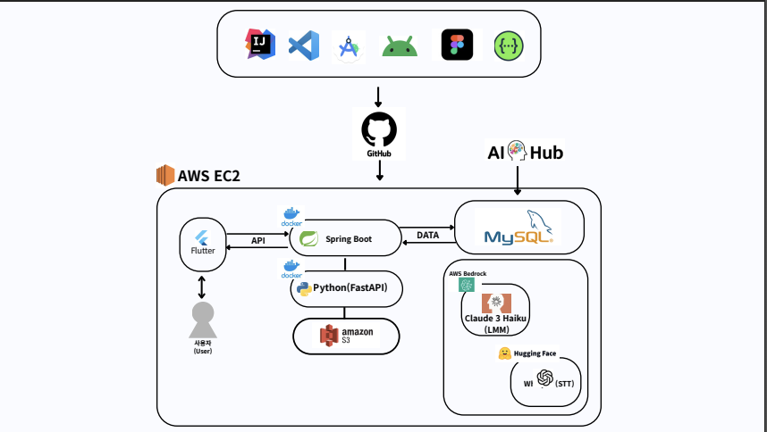
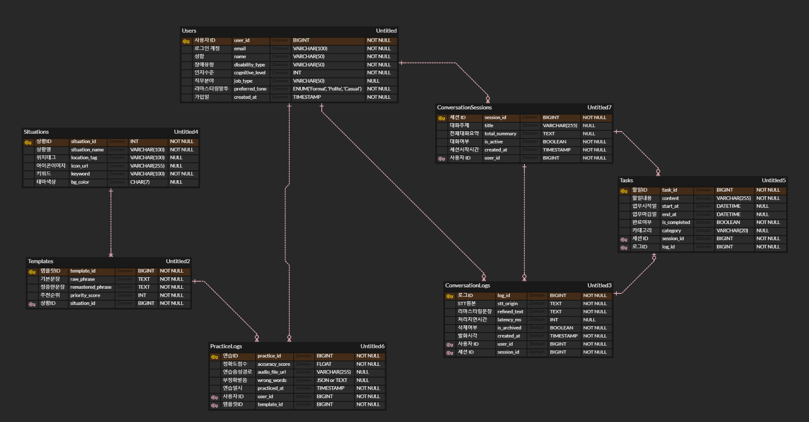
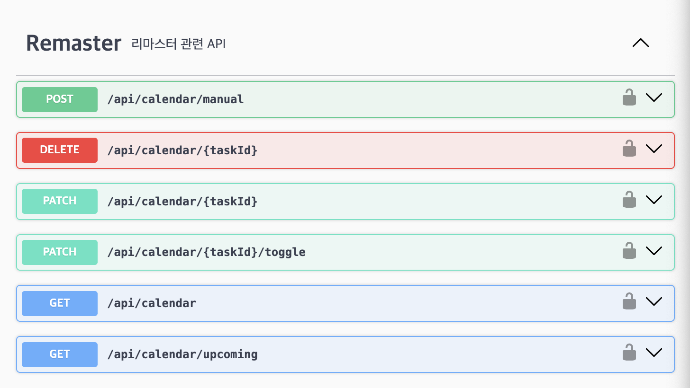
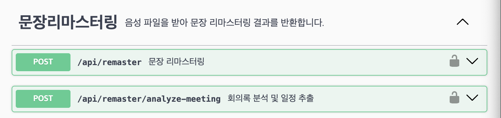
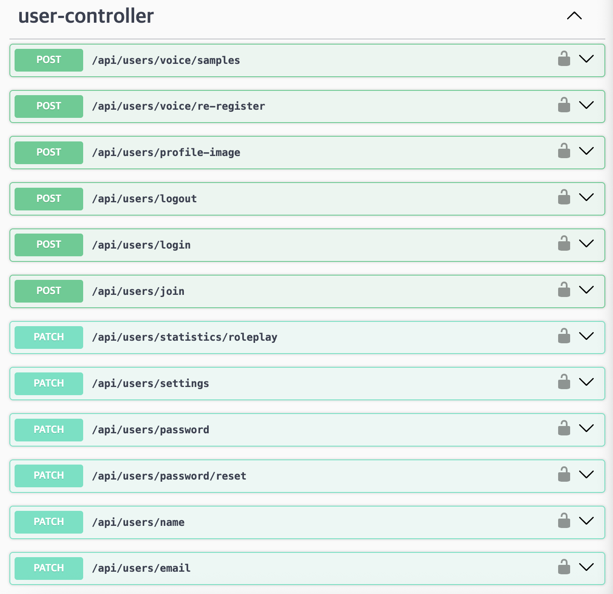
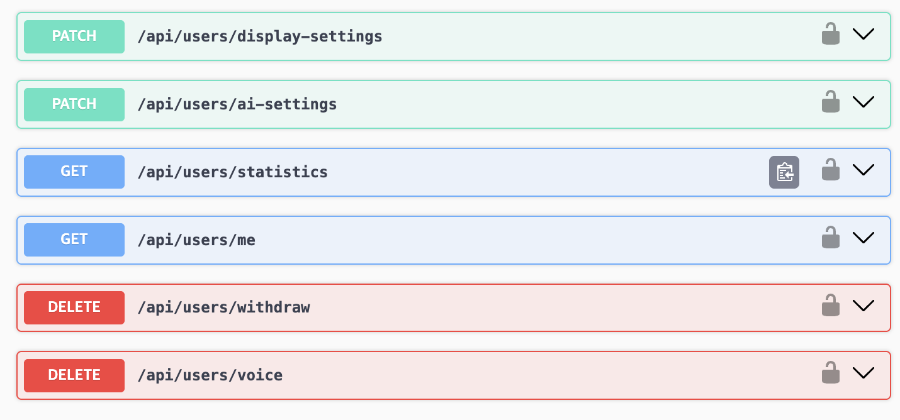
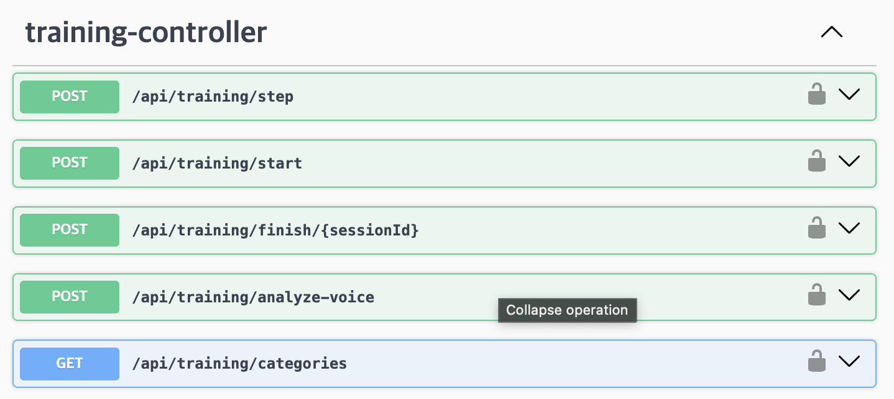

# 2026 Capstone Design < malbit >
## 🎨 말빛(Malbit)
URL : https://example.com  
시연영상(Youtube) : https://youtube.com/xxxx

---

## 🔮 Table of Contents
- [Demo](#-demo)
- [System Architecture](#️-system-architecture)
- [Tech Stack](#️-tech-stack)
- [ERD](#erd)
- [API](#-api)

---

## 🎥 Demo
앱 시연 영상/GIF

---

## 🏗️ System Architecture

  

---

## ⚒️ Tech Stack

| Field | Technology of Use |
|-------|-------------------|
| **Cloud Infra** |    |
| **Virtualization** |   |
| **IDE** |    |
| **API** |   |
| **Design** |  |
| **Language** |    |
| **Frontend** |  |
| **Backend** |   |
| **Database** |  |
| **Storage** |  |
| **Key Tech** |      |

---

## ERD

  

---

## 📡 API

  

  

  

  

  

  

